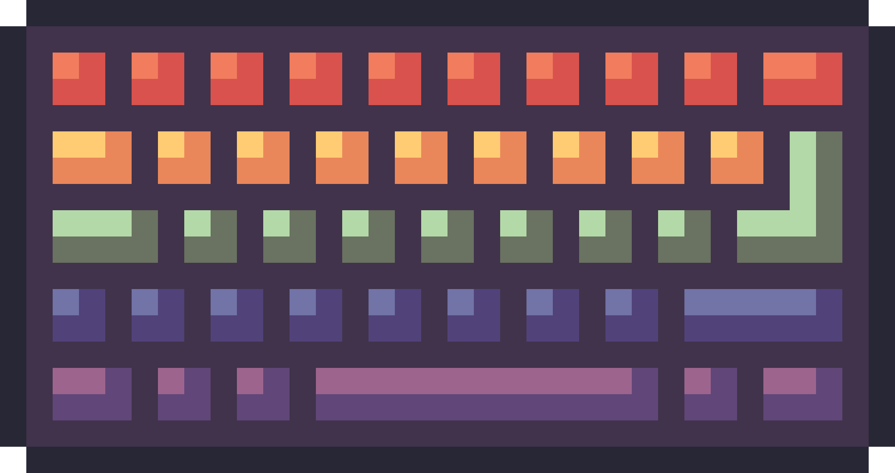

<div align="center">
    
    <h1>Keyboard Input</h1>
    <p>A cross-platform raw keyboard input handling library for Zig.</p>
</div>

> [!WARNING]
> This library currently only supports ASCII characters.

## Features

- Supports Windows, macOS, and Linux.
- Reads keyboard state directly from the OS, bypassing the terminal buffer.
- Built entirely with the Zig standard library and native OS APIs.

## Installation

1. Fetch the dependency using Zig's package manager:

```sh
zig fetch --save git+https://github.com/ironloom/keyboard-input.git
```

2. Add the dependency to your `build.zig`:

```zig
const kb_input_dep = b.dependency("keyboard_input", .{
    .target = target,
    .optimize = optimize,
});

exe.root_module.addImport("kb_input", kb_input_dep.module("keyboard_input"));
```

## Usage

```zig
const std = @import("std");
const kb_input = @import("kb_input");

pub fn main() !void {
    var gpa = std.heap.GeneralPurposeAllocator(.{}){};
    defer _ = gpa.deinit();

    try kb_input.init(gpa.allocator());
    defer kb_input.deinit();

    while (!kb_input.getKeyDown('q')) {
        // Must be called every frame to refresh input state
        kb_input.update();
        
        if (kb_input.getKey('w')) {
            std.debug.print("Walking forward!\n", .{});
        }
        
        std.time.sleep(16 * std.time.ns_per_ms);
    }
}
```

## API Reference

- `init(allocator: Allocator) !void`: Initializes the keyboard input system.
- `initSafe() void`: Wraps `init()` with `std.heap.smp_allocator` and aborts on setup failure. **Note: This method is not meant to be called unless the package is being used through the C ABI.**
- `deinit() void`: Cleans up resources.
- `update() void`: Refreshes the internal keyboard state. Must be called once per frame.
- `getKey(key: u8) bool`: Returns `true` if the key is held down.
- `getKeyDown(key: u8) bool`: Returns `true` if the key was just pressed this frame.
- `getKeyUp(key: u8) bool`: Returns `true` if the key was just released this frame.
- `keyPressed() bool`: Returns `true` if any key is pressed.
